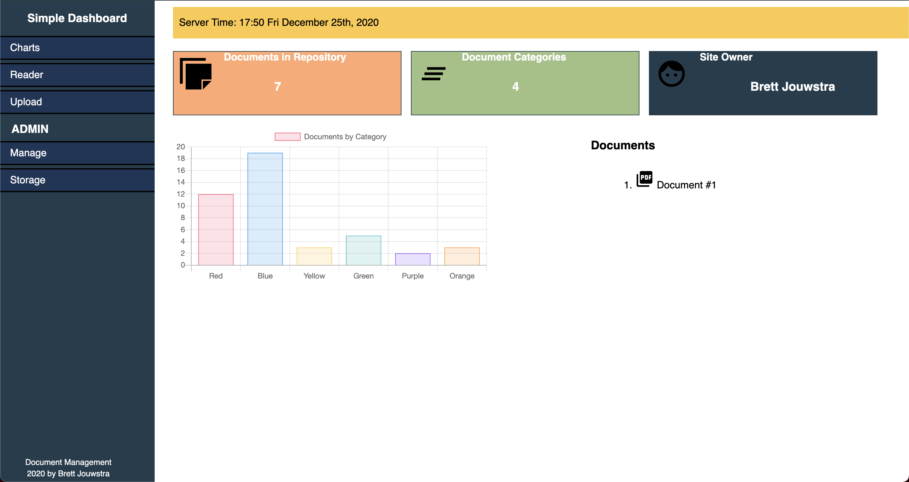

# Simple Dashboard

Simple Dashboard is meant to be just that... simple! Easy to change, extend, use, etc. 

The sidebar is built using [PureCSS](https://purecss.io) and the graphs are a product of [Charts.js](https://www.chartjs.org) otherwise everything else is straightforward custom css. 

All files for just the Dashboard can be found in the templates + public directories.

# Simple Docs

The application Simple Dashboard was created for is Simple Docs, an easy stress free document manager using MongoDB's GridFS as a storage location

Submitting a POST request to the `/-/create` endpoint like this:

~~~shell
curl --request POST \
  --url http://127.0.01:8000/-/create \
  --header 'Content-Type: multipart/form-data' \
  --form files=@path/to/local/file \
  --form 'description=zip file' \
  --form sensitive=false
~~~

Will save the uploaded file as a binary object and create a reference collection that stores:

- Original Doc. Name 
- New Name 
- Description 
- Sensitive (Yes/No) 
- Type (Derived from the file's MIME/Type)
- Category (Receipt, Bill, etc.)

The files are then viewable at the `/-/view` endpoint by adding on the filename for example `/-/view/ba964d64-ae50-4fb3-a791-156b7190d2cc.pdf`

### Changes/Updates

To make adjustments simplely edit the CSS files named according to the elements they style. 

1. leftnav.css - styles the navigation bar

2. main.css - styles the main content area

3. modal.css - styles the modal and the componets that interact with it (i.e. the buttons to open it, etc.)

### Screenshot

